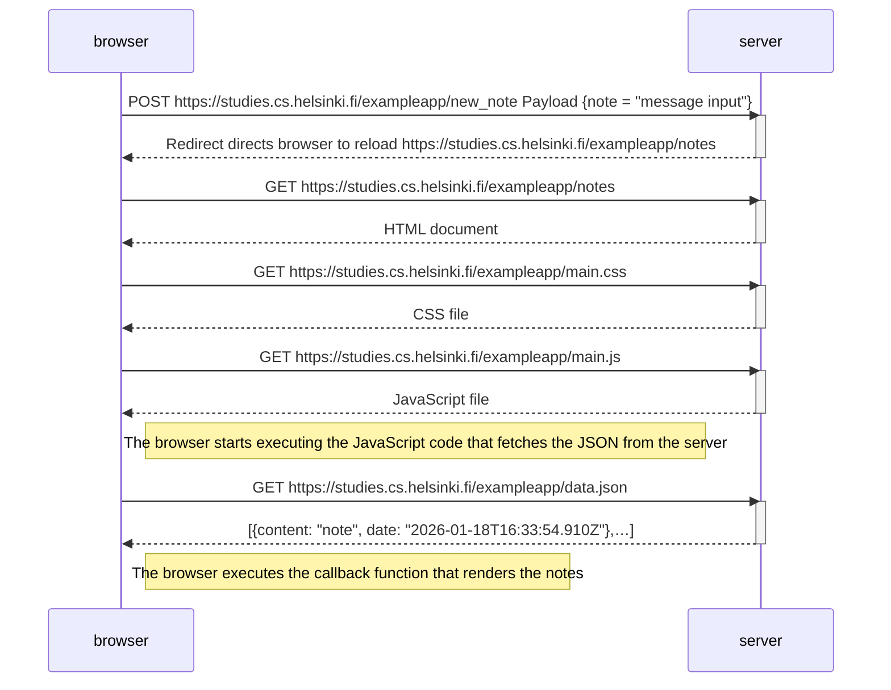

```mermaid
sequenceDiagram
  participant browser
  participant server

  browser->>server: POST https://studies.cs.helsinki.fi/exampleapp/new_note Payload {note = "message input"}
  activate server
  server-->>browser: Redirect directs browser to reload https://studies.cs.helsinki.fi/exampleapp/notes
  deactivate server

  browser->>server: GET https://studies.cs.helsinki.fi/exampleapp/notes
  activate server
  server-->>browser: HTML document
  deactivate server

  browser->>server: GET https://studies.cs.helsinki.fi/exampleapp/main.css
  activate server
  server-->>browser: CSS file
  deactivate server

  browser->>server: GET https://studies.cs.helsinki.fi/exampleapp/main.js
  activate server
  server-->>browser: JavaScript file
  deactivate server

  Note right of browser: The browser starts executing the JavaScript code that fetches the JSON from the server

  browser->>server: GET https://studies.cs.helsinki.fi/exampleapp/data.json
  activate server
  server-->>browser: [{content: "note", date: "2026-01-18T16:33:54.910Z"},…]
  deactivate server

  Note right of browser: The browser executes the callback function that renders the notes
```