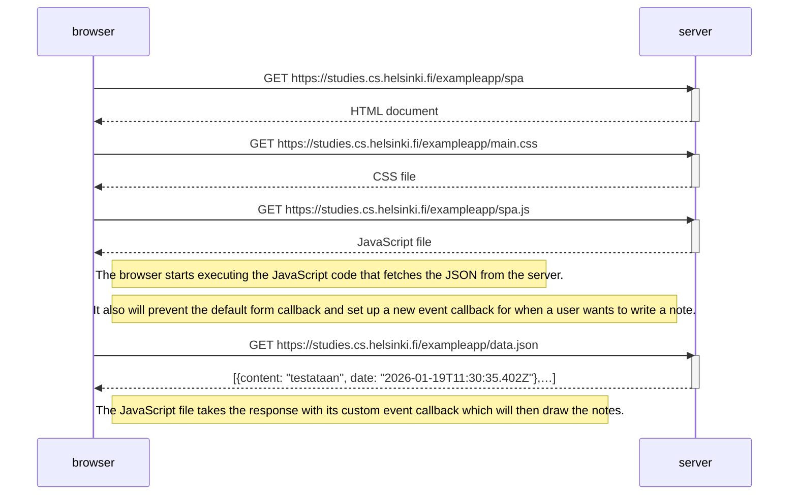

```mermaid
sequenceDiagram
  participant browser
  participant server
  
  browser->>server: GET https://studies.cs.helsinki.fi/exampleapp/spa
  activate server
  server-->>browser: HTML document
  deactivate server

  browser->>server: GET https://studies.cs.helsinki.fi/exampleapp/main.css
  activate server
  server-->>browser: CSS file
  deactivate server

  browser->>server: GET https://studies.cs.helsinki.fi/exampleapp/spa.js
  activate server
  server-->>browser: JavaScript file
  deactivate server

  Note right of browser: The browser starts executing the JavaScript code that fetches the JSON from the server.
  Note right of browser: It also will prevent the default form callback and set up a new event callback for when a user wants to write a note.

  browser->>server: GET https://studies.cs.helsinki.fi/exampleapp/data.json
  activate server
  server-->>browser: [{content: "testataan", date: "2026-01-19T11:30:35.402Z"},…]
  deactivate server
	
  Note right of browser: The JavaScript file takes the response with its custom event callback which will then draw the notes.
```