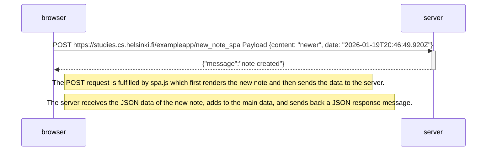

```mermaid
sequenceDiagram
  participant browser
  participant server
  
  browser->>server: POST https://studies.cs.helsinki.fi/exampleapp/new_note_spa  Payload {content: "newer", date: "2026-01-19T20:46:49.920Z"}
  activate server
  server-->>browser: {"message":"note created"}
  deactivate server

  Note right of browser: The POST request is fulfilled by spa.js which first renders the new note and then sends the data to the server.
  Note right of browser: The server receives the JSON data of the new note, adds to the main data, and sends back a JSON response message.

```